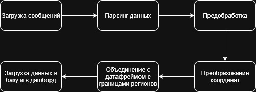
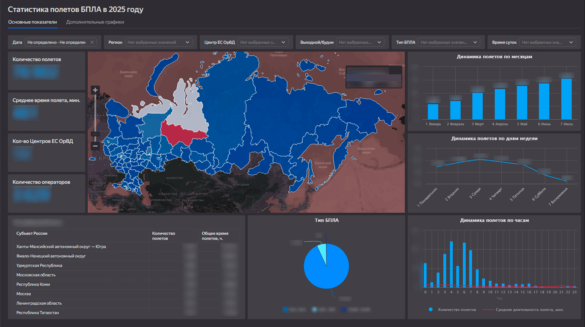

## Цель проекта
Автоматизировать обработку данных Росавиации, сократить трудозатраты госорганов и предоставить удобный инструмент аналитики и визуализации.

  

## Навыки и инструменты
- PYTHON
- PANDAS
- GEOPANDAS
- SHAPELY
- SQL
- DATALENS

Дашборд:

