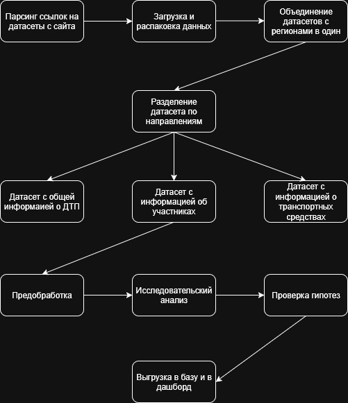

## Описание проекта
Провести глубокий анализ данных о дорожно-транспортных происшествиях (ДТП) в России за период с 2015 по 2025 г., сформулировать и проверить гипотезы, опираясь на доступные признаки.
Построить дашборд.

Ссылка на дашборд: https://datalens.yandex/vxendhi5oiq8g

## Навыки и инструменты
- PYTHON
- PANDAS
- SCIPY
- MATPLOTLIB
- STATSMODEL

## Итоговые выводы:
- За десятилетие отмечается устойчивая тенденция снижения числа ДТП и смертельных исходов.
- Увеличение количества ДТП в летние месяцы и в пятницу-субботу.
- Больше всего гибнут водители в абсолютных цифрах, но самый высокий риск смерти у дорожных рабочих (22–23%) и у пешеходов вне транспорта (до 16%), у пассажиров и велосипедистов (5%), водителей (3%).
- Опытные водители (10-20 лет стажа) - наиболее частые участники ДТП (31%)
- Влияние алкоголя: значительно повышает риск смертельного исхода.
- Нарушения пешеходов: повышают риск гибели в 4 раза.
- Превышение скорости: увеличивает вероятность тяжелых последствий.

## Рекомендации:
- Усиление контроля:
   - За соблюдением скоростного режима
   - За управлением в состоянии опьянения
   - За соблюдением ПДД пешеходами, особенно переход вне зебр
   - За соблюдением техники безопасности дорожных рабочих
   - За соблюдением ПДД в выходные дни, а также в летние месяцы
- Улучшение инфраструктуры:
   - Уличное освещение (критически важно, вероятность летальных исходов достигает 25%)
   - Организация специальных переходов и ограждений для предотвращения выхода пешеходов на проезжую часть
   - Улучшенная организация зон дорожны работ
- Образовательные компании
   - Образовательные программы о последствиях нарушений пешеходами ПДД, объяснять, что даже 10–20 метров "сэкономленного пути" могут стоить жизни, устанавливать где чаще всего фиксируется переход "вне перехода".
   - Ввести образовательные программы для детей и подростков
   - Борьба с алкоголем как для водителей  так и для пешеходов
- Фокус внимания:
   - Округа с высокой аварийностью: Сибирский и Северо-Западный ФО
   - Регионы с высокой аварийностью: Краснодарский край
- Бесплатная раздача светоотражателей детям и пожилым в регионах с высокой смертностью.
- Цифровой контроль пешеходов
